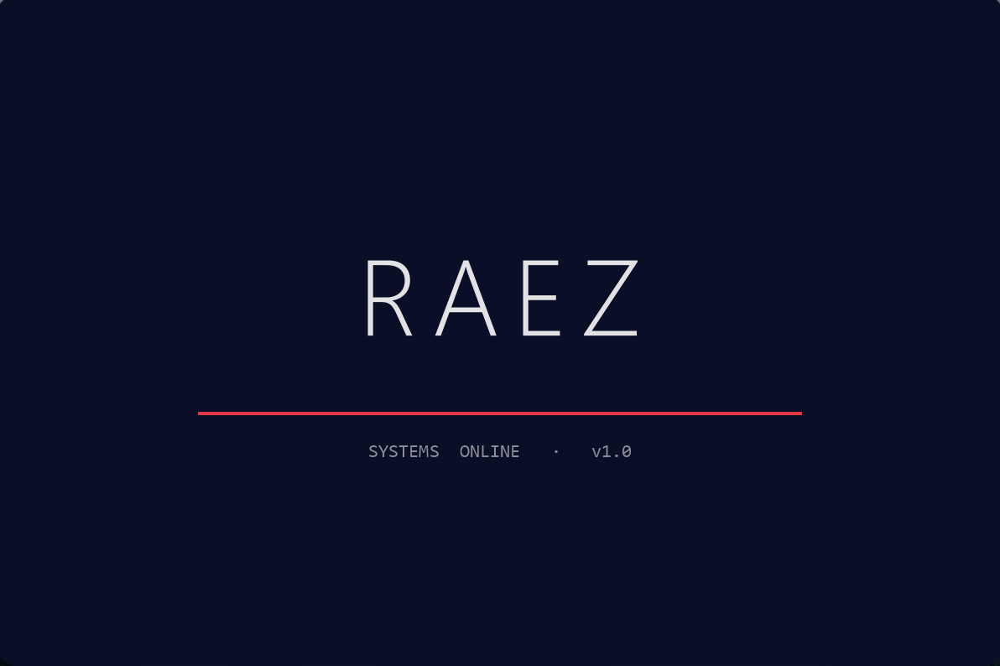
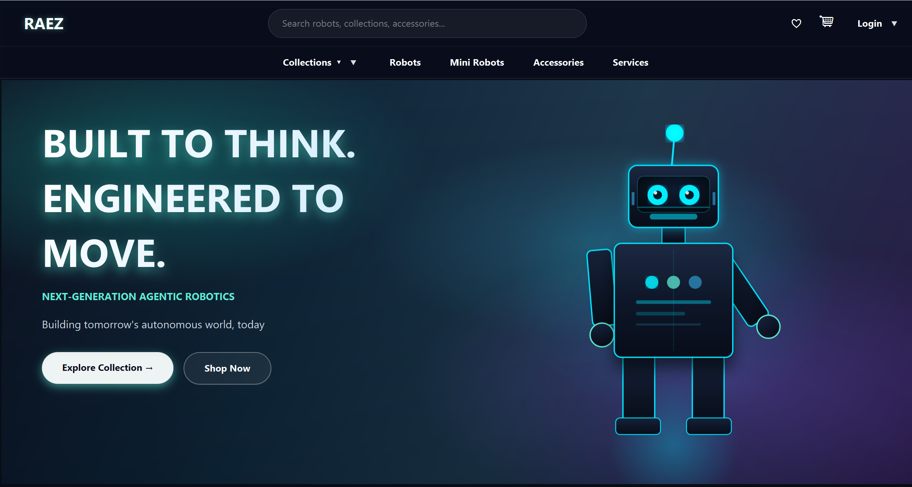
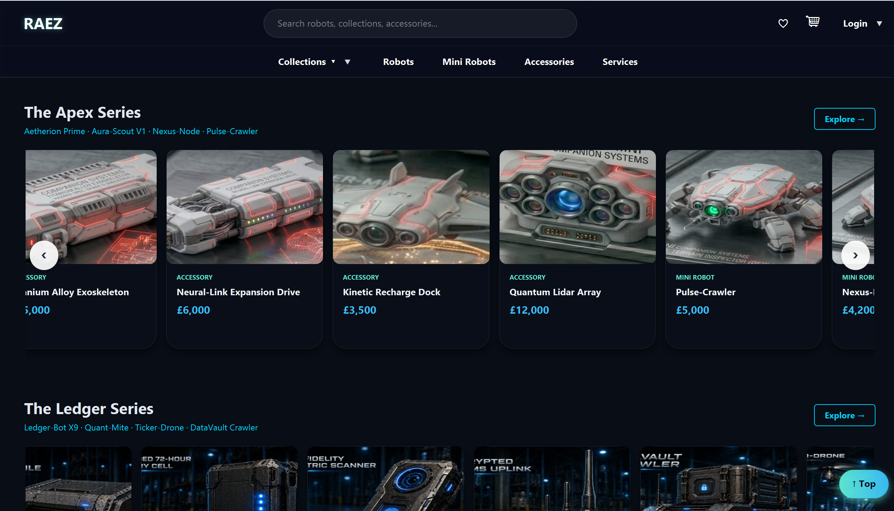
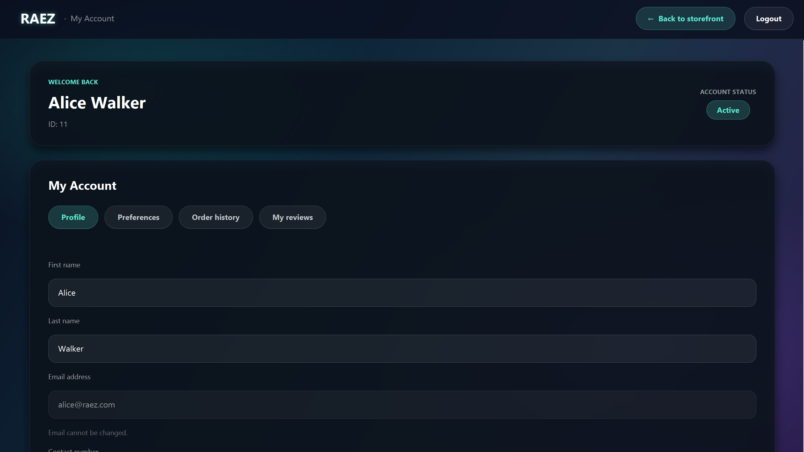

# Raez

> Native JavaFX desktop e-commerce and back-office for a next-generation robotics company.


[](https://github.com/AnassNadeem/raez-ecommerce-app/actions/workflows/ci.yml)
[](LICENSE)

## What it is

Raez is a Windows-native desktop application that bundles a customer-facing **storefront** and a **7-module back-office** (Finance, Warehouse, Delivery, Reviews, Orders, Customer admin, Super-admin) into a single JavaFX 21 program backed by one embedded SQLite database. It ships as a double-clickable `.exe` installer built with `jpackage`.

The project is the integrated output of a 7-person team — each module was owned by a different contributor and merged into a single application with role-based access control.

## Highlights

- **Coded JavaFX launcher** — hand-animated wordmark + sweep underline, replacing a stock MP4 splash.
- **Cloudinary image pipeline** with on-the-fly transforms and a transparent local fallback.
- **Security pass** — PreparedStatements end-to-end, BCrypt cost-12 password hashing, idempotent password-migration utility with CSV backup.
- **Background JavaFX `Task` workers** for login + checkout so the UI thread never blocks.
- **19 JUnit 5 tests** across auth, products, orders, and DAOs, run on every push by GitHub Actions.
- **`jpackage` Windows installer** — clone, `mvn -Pinstaller package`, double-click the `.exe`.

## Features by module

| Module | What it does |
| --- | --- |
| **Storefront** | Dark-themed product browsing, collection pages, product detail with reviews, cart and checkout, order history, customer account. |
| **Auth** | Email + BCrypt sign-up and login, role-based routing for staff (Admin / Finance / Warehouse / Delivery / Reviews / Customer-admin), two-stage SMTP password reset. |
| **Finance** | Invoices, customer/order/product reports with PDFBox export, revenue + VAT aggregations, financial-anomaly detection, audit log, SMTP settings. |
| **Warehouse** | Stock and supplier management, low-stock alerts, PDF stock reports via iText. |
| **Delivery** | Driver and delivery-order dashboards, status transitions. |
| **Reviews** | Review submission with eligibility gating (must have purchased), admin moderation queue, helpful-vote tracking. |
| **Orders** | Order placement, history, finance hand-off via auto-created invoices. |
| **Customer admin** | Customer record management for back-office staff. |
| **Super-admin** | Cross-module dashboard, user/role management, system-wide settings. |

## Tech stack

| Layer       | Choice                       | Why                                                                  |
| ----------- | ---------------------------- | -------------------------------------------------------------------- |
| UI          | JavaFX 21 (Controls + FXML)  | Native desktop, zero web-runtime dependency, fluent CSS theming.     |
| DB          | SQLite + WAL                 | Zero-config single-user data store; WAL gives concurrent reads.     |
| Auth        | jBCrypt 0.4                  | Industry-standard adaptive password hashing.                         |
| Images      | Cloudinary + local fallback  | CDN delivery and resize-on-URL; works offline without credentials.   |
| Email       | Jakarta Mail (Angus 2.0.3)   | SMTP for password-reset and invoice notifications.                   |
| PDF         | iText 5 + PDFBox 3           | iText for warehouse stock reports, PDFBox for finance exports.       |
| Stats       | Apache Commons Math 3        | Linear-regression revenue prediction in Finance.                     |
| Logging     | SLF4J 2 + Logback 1.4        | Structured, configurable, rolling-file output under `~/.raez/logs/`. |
| Build       | Maven (with wrapper)         | Standard, CI-friendly, profile-driven (`demo`, `installer`).         |
| Tests       | JUnit 5                      | 19 tests across auth, products, orders, DAOs.                        |
| CI          | GitHub Actions               | Runs `mvn -B test` on every push and PR.                             |
| Installer   | `jpackage` (JDK 21)          | Native Windows `.exe` with bundled runtime.                          |

## Architecture

- `com.raez.model` — domain entities + `MainLauncher` (JavaFX `Application` entry point).
- `com.raez.controllers` — storefront and admin-shell FXML controllers.
- `com.raez.db` — single `DBConnection` that boots SQLite (WAL, foreign keys), runs schema + idempotent migrations, and seeds an empty DB.
- `com.raez.storage` — `ImageStorage` interface, `CloudinaryImageStorage`, `LocalImageStorage`, `ImageStorageFactory`.
- `com.raez.<module>` — module-scoped `controller` / `dao` / `model` / `service` / `util` packages for finance, warehouse, delivery, reviews, orders, customer.

## How to use

Requires **JDK 21** (Temurin recommended). The Maven wrapper (`mvnw`) is bundled — no global Maven install needed.

### 1. Clone

```bash
git clone https://github.com/AnassNadeem/raez-ecommerce-app.git
cd raez-ecommerce-app
```

### 2. Run (offline demo mode)

No Cloudinary account, no SMTP creds — just runs.

```bash
./mvnw -Pdemo javafx:run
```

The first launch creates a fresh SQLite DB from the bundled seed data with demo users, products, and orders.

### 3. Run (full mode with Cloudinary)

```bash
# Linux / macOS
cp config.properties.example ~/.raez/config.properties

# Windows (PowerShell)
Copy-Item config.properties.example "$env:USERPROFILE\.raez\config.properties"
```

Fill in `cloudinary.cloud_name`, `cloudinary.api_key`, `cloudinary.api_secret`, then:

```bash
./mvnw javafx:run
```

### 4. Run the tests

```bash
./mvnw test
```

### 5. Build the Windows installer

```bash
./mvnw -Pinstaller package
# → target/installer/Raez-1.0.0.exe
```

Requires WiX Toolset 3.x on `PATH`. To skip WiX, switch `--type exe` to `--type app-image` in the `installer` profile to get an unpacked directory.

## Download

A pre-built Windows installer is attached to the latest [GitHub Release](https://github.com/AnassNadeem/raez-ecommerce-app/releases).

## Screenshots

| Launcher | Storefront hero |
| --- | --- |
|  |  |

| Product grid | My account | Super-admin |
| --- | --- | --- |
|  |  |  |

## What I'd build next

- **Postgres swap** — port `DBConnection` to a driver-agnostic shim and run multi-user against managed Postgres.
- **Stripe checkout** — replace the in-app payment placeholder with hosted Stripe checkout + webhook-driven finalization.
- **REST API extraction** — pull the service layer into a Spring Boot module so the same back-office can power a web admin and a mobile app.
- **macOS / Linux installers** — `jpackage` `.dmg` and `.deb` outputs in CI, attached to every release.

## Troubleshooting

<details>
<summary>Cloudinary upload fails / "ImageStorage = Local" in logs</summary>

Expected when `~/.raez/config.properties` is missing or the network probe times out. The app falls back to `LocalImageStorage` automatically; uploads land in `~/.raez/images/`. Add valid Cloudinary credentials and restart to switch.
</details>

<details>
<summary>JDK 21 not found</summary>

Install [Eclipse Temurin 21](https://adoptium.net/temurin/releases/?version=21). On Windows make sure `JAVA_HOME` points to the Temurin 21 install and `%JAVA_HOME%\bin` is on `PATH`.
</details>

<details>
<summary><code>./mvnw javafx:run</code> hangs on Windows</summary>

Most often a Cloudinary probe stalling. Use the demo profile to skip it: <code>./mvnw -Pdemo javafx:run</code>.
</details>

<details>
<summary><code>jpackage</code> fails with "WiX Toolset not found"</summary>

Install [WiX Toolset 3.x](https://wixtoolset.org/releases/) and add its `bin` directory to `PATH`, or switch <code>--type exe</code> to <code>--type app-image</code> in the <code>installer</code> profile to get an unpacked directory instead.
</details>

## Contributors

This project was built by a 7-person team. Each contributor owned one or more modules; final integration, the storefront, and the Finance module were owned by Anass.

| Contributor | Modules |
| --- | --- |
| [**Anass Nadeem**](https://github.com/AnassNadeem) | Integration · Storefront · Finance |
| [_Teammate name_](https://github.com/USERNAME) | Warehouse |
| [_Teammate name_](https://github.com/USERNAME) | Delivery |
| [_Teammate name_](https://github.com/USERNAME) | Reviews & Rating |
| [_Teammate name_](https://github.com/USERNAME) | Products |
| [_Teammate name_](https://github.com/USERNAME) | Customer admin |
| [_Teammate name_](https://github.com/USERNAME) | Super-admin / Auth |

---

Built by **Anass Nadeem** — [LinkedIn](https://www.linkedin.com/in/anass-nadeem/) · [GitHub](https://github.com/AnassNadeem)
