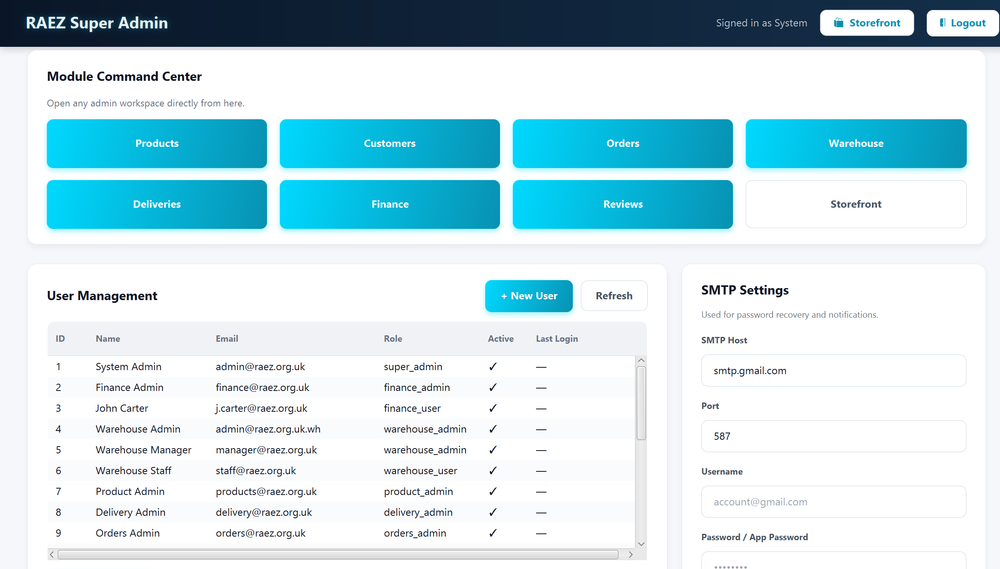

# Raez

> Native JavaFX desktop e-commerce and back-office for a next-generation robotics company.


[](https://github.com/AnassNadeem/raez-ecommerce-app/actions/workflows/ci.yml)
[](LICENSE)

## What it is

Raez is a Windows-native desktop application that bundles a customer-facing storefront and a 7-module back-office (Finance, Warehouse, Delivery, Reviews, Orders, Customer admin, Super-admin) into a single JavaFX 21 program backed by a single embedded SQLite database. It ships as a double-clickable `.exe` installer built with `jpackage`.

## Features

- **Storefront** — dark-themed product browsing, collection pages, product detail with reviews and Q&A, cart and checkout, order history, customer account.
- **Auth** — email + BCrypt-hashed password sign-up and login, role-based access for staff (Admin / Finance / Warehouse / Delivery / Reviews / Customer-admin), two-stage password reset over SMTP.
- **Finance back-office** — invoices, customer/order/product reports with PDF export (PDFBox), revenue + VAT aggregations, light-weight financial-anomaly detection, audit log, SMTP settings.
- **Warehouse** — stock and supplier management, low-stock alerts, PDF stock reports (iText).
- **Delivery** — driver and delivery-order dashboards, status transitions.
- **Reviews** — review submission with eligibility gating, admin moderation queue, vote tracking.
- **Image storage** — Cloudinary upload with on-the-fly transforms (`c_fill,w_300,h_300,q_auto,f_auto`); falls back to local `~/.raez/images/` automatically when no credentials are configured or the network probe fails.
- **Logging** — SLF4J + Logback, console at INFO and rolling file at DEBUG under `~/.raez/logs/raez.log`.

## Tech stack

| Layer       | Choice                       | Why                                                                  |
| ----------- | ---------------------------- | -------------------------------------------------------------------- |
| UI          | JavaFX 21 (Controls + FXML)  | Native desktop, zero web-runtime dependency, fluent CSS theming.     |
| DB          | SQLite + WAL                 | Zero-config single-user data store; WAL gives concurrent reads.      |
| Auth        | jBCrypt 0.4                  | Industry-standard adaptive password hashing.                         |
| Images      | Cloudinary + local fallback  | CDN delivery and resize-on-URL; works offline without credentials.   |
| Email       | Jakarta Mail (Angus 2.0.3)   | SMTP for password-reset and invoice notifications.                   |
| PDF         | iText 5 + PDFBox 3           | Different report styles; iText for warehouse, PDFBox for finance.    |
| Stats       | Apache Commons Math 3        | Linear-regression revenue prediction in Finance.                     |
| Logging     | SLF4J 2 + Logback 1.4        | Structured, configurable, rolling-file output.                       |
| Build       | Maven                        | Standard, CI-friendly, profile-driven.                               |
| Tests       | JUnit 5                      | 19 tests across auth, products, orders, DAOs.                        |
| Installer   | `jpackage` (JDK 21)          | Native Windows `.exe` with bundled runtime.                          |

## Architecture

- `com.raez.model` — domain entities + `MainLauncher` (JavaFX `Application` entry point).
- `com.raez.controllers` — storefront and admin-shell FXML controllers.
- `com.raez.db` — single `DBConnection` that boots SQLite (WAL, foreign keys), runs schema + idempotent migrations, and seeds an empty DB.
- `com.raez.storage` — `ImageStorage` interface, `CloudinaryImageStorage`, `LocalImageStorage`, `ImageStorageFactory`.
- `com.raez.<module>` — module-scoped `controller` / `dao` / `model` / `service` / `util` packages for finance, warehouse, delivery, reviews, orders, customer.

## Run it

Requires JDK 21 (Temurin recommended). Maven wrapper is included; no global Maven needed.

```bash
git clone https://github.com/AnassNadeem/raez-ecommerce-app.git
cd raez-ecommerce-app
./mvnw -Pdemo javafx:run     # offline mode — local image storage, no Cloudinary needed
```

Full mode with Cloudinary:

1. Copy `config.properties.example` to `~/.raez/config.properties` (Linux/macOS) or `%USERPROFILE%\.raez\config.properties` (Windows).
2. Fill in `cloudinary.cloud_name`, `cloudinary.api_key`, `cloudinary.api_secret`.
3. `./mvnw javafx:run`

Tests: `./mvnw test`

## Download

A pre-built Windows installer is attached to the latest [GitHub Release](https://github.com/AnassNadeem/raez-ecommerce-app/releases). Build it locally with:

```bash
./mvnw -Pinstaller package
# → target/installer/Raez-1.0.0.exe
```

Requires WiX Toolset 3.x on `PATH` for the `.exe` type; otherwise switch `--type` to `app-image` in the `installer` profile to get an unpacked directory.

## Screenshots

| Storefront | Cart | Admin |
| --- | --- | --- |
|  |  |  |

## Engineering case study

A snapshot of the production-readiness work on the `production-ready` branch:

| Metric                 | Before              | After               |
| ---------------------- | ------------------- | ------------------- |
| Startup time           | _TBD_               | _TBD_               |
| Repo size (no .git)    | _TBD_               | ~9.5 MB             |
| JAR size               | _TBD_               | _TBD_               |
| Image load latency     | local-disk only     | Cloudinary CDN      |
| Password storage       | plaintext           | BCrypt cost-12      |
| SQL surface            | mixed concat / PS   | PreparedStatement-only |
| Tests                  | 0                   | 19 (JUnit 5)        |
| CI                     | none                | GitHub Actions      |
| Distribution           | `mvn javafx:run`    | `.exe` via `jpackage` |

Numbers marked _TBD_ are filled in after running `Measure-Command { mvn javafx:run }`, `(Get-Item target/raez-*.jar).Length`, and `git count-objects -vH`.

## What I'd build next

- **Postgres swap** — port `DBConnection` to a small driver-agnostic shim and run multi-user against a managed Postgres.
- **Stripe checkout** — replace the in-app payment placeholder with a hosted Stripe checkout session and webhook-driven order finalization.
- **REST API extraction** — pull the service layer into a Spring Boot module so the same back-office can be consumed from a web admin and a mobile app.
- **macOS / Linux installers** — `jpackage` `.dmg` and `.deb` outputs in CI, attached to every release.

## Troubleshooting

<details>
<summary>Cloudinary upload fails / "ImageStorage = Local" in logs</summary>

Expected when `~/.raez/config.properties` is missing or the network probe times out. The app falls back to `LocalImageStorage` automatically; uploads land in `~/.raez/images/`. Add valid Cloudinary credentials and restart to switch.
</details>

<details>
<summary>JDK 21 not found</summary>

Install [Eclipse Temurin 21](https://adoptium.net/temurin/releases/?version=21). On Windows make sure `JAVA_HOME` points to the Temurin 21 install and `%JAVA_HOME%\bin` is on `PATH`.
</details>

<details>
<summary><code>./mvnw javafx:run</code> hangs on Windows</summary>

Most often a Cloudinary probe stalling. Use the demo profile to skip it: `./mvnw -Pdemo javafx:run`.
</details>

<details>
<summary><code>jpackage</code> fails with "WiX Toolset not found"</summary>

Install [WiX Toolset 3.x](https://wixtoolset.org/releases/) and add its `bin` directory to `PATH`, or switch `--type exe` to `--type app-image` in the `installer` profile to get an unpacked directory instead.
</details>

---

Built by **Anass Nadeem** — [LinkedIn](https://www.linkedin.com/in/anass-nadeem/) · [GitHub](https://github.com/AnassNadeem)
