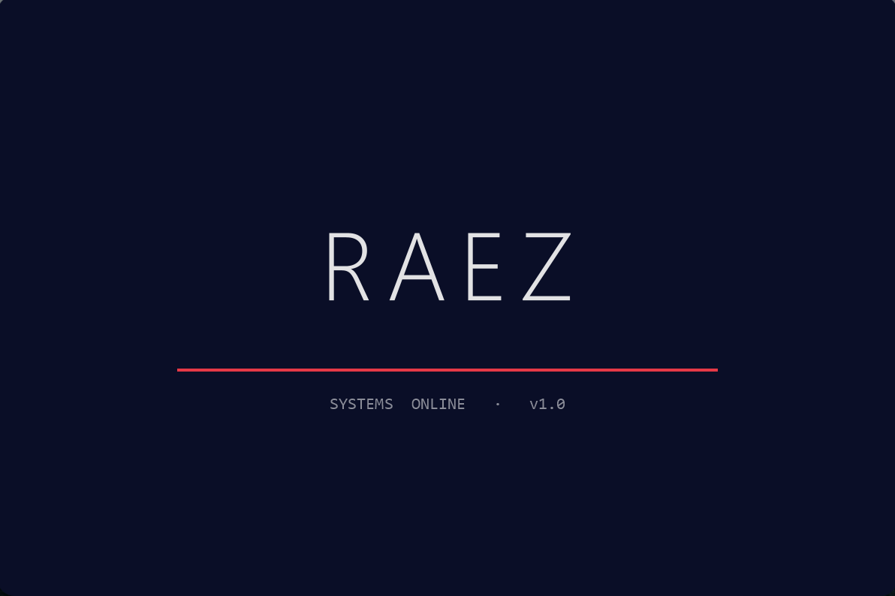
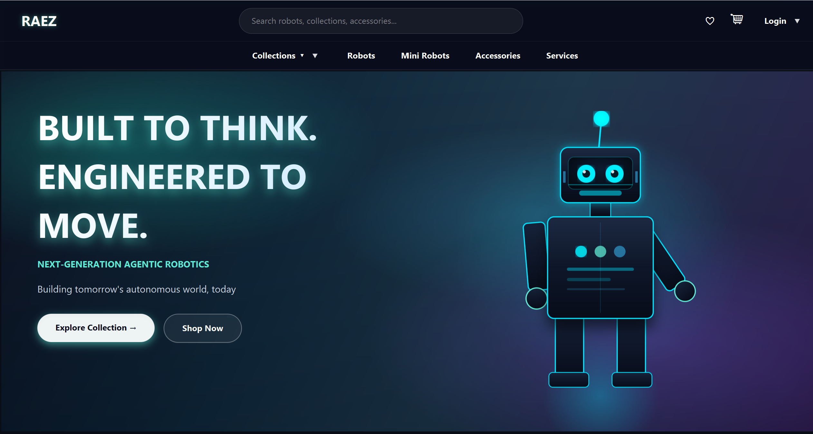
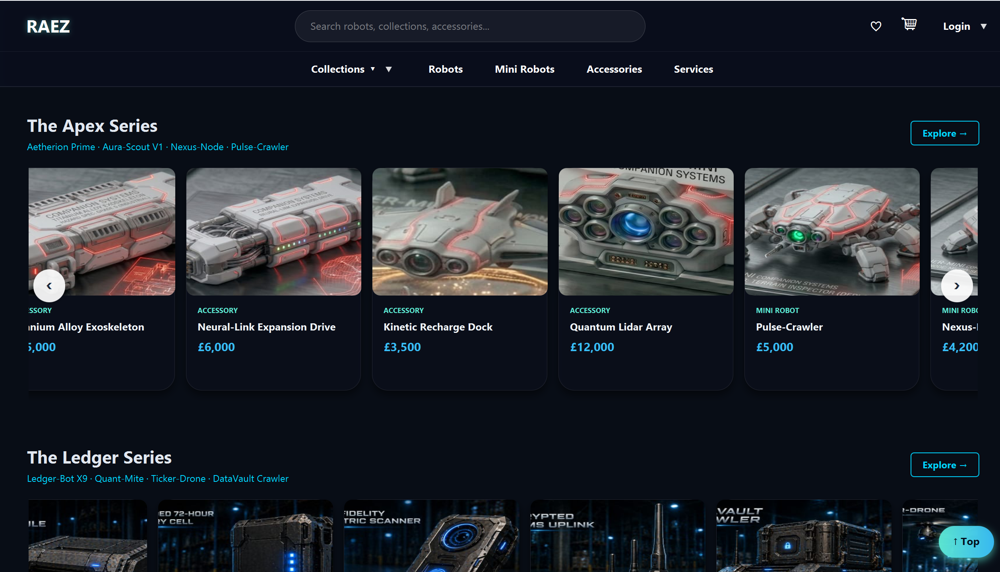
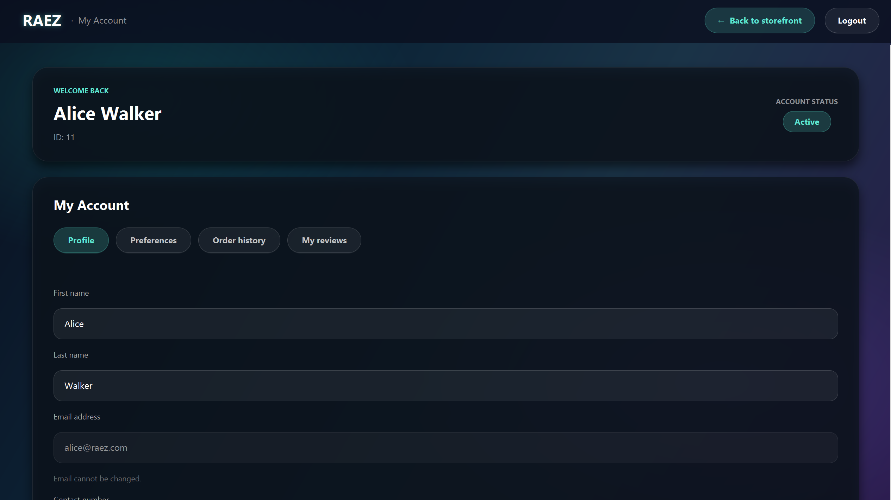
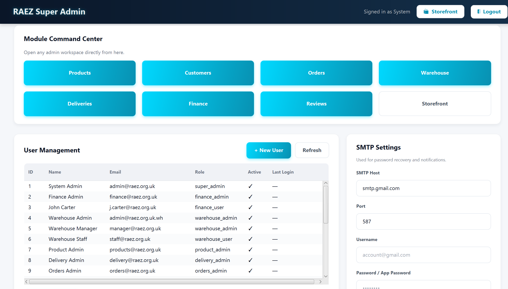

# RAEZ

JavaFX desktop storefront and back-office for a robotics retailer.

This is a fork of the [team project](https://github.com/AnassNadeem/raez-ecommerce-app). My primary contribution was the Warehouse module, with additional integration and debugging work. Module ownership is listed under [Contributors](#contributors).


Upstream smoke test: [](https://github.com/AnassNadeem/raez-ecommerce-app/actions/workflows/ci.yml)
[](LICENSE)

## What it is

Raez is a Windows-native desktop application that bundles a customer-facing **storefront** and a **7-module back-office** (Finance, Warehouse, Delivery, Reviews, Orders, Customer admin, Super-admin) into a single JavaFX 21 program backed by one embedded SQLite database. It ships as a double-clickable `.exe` installer built with `jpackage`.

The project is the integrated output of a 7-person team — each module was owned by a different contributor and merged into a single application with role-based access control.

## Highlights

- **JavaFX launcher** with an animated wordmark and underline.
- **Optional Cloudinary image storage** with local upload storage when credentials or connectivity are unavailable.
- **Authentication utilities** with BCrypt password hashing and a password-migration tool. Legacy seed accounts also support SHA-256 verification.
- **Background JavaFX `Task` workers** for login and checkout.
- **19 JUnit 5 tests** across authentication, products, orders, and DAOs. The CI workflow currently runs the smoke test only.
- **Windows installer build** using `jpackage` and the Maven `installer` profile.

## Features by module


| Module             | What it does                                                                                                                                                       |
| ------------------ | ------------------------------------------------------------------------------------------------------------------------------------------------------------------ |
| **Storefront**     | Dark-themed product browsing, collection pages, product detail with reviews, cart and checkout, order history, customer account.                                   |
| **Auth**           | Email sign-up and login, role-based staff routing, BCrypt support with legacy seed-password compatibility, and SMTP password reset. |
| **Finance**        | Invoices, customer/order/product reports with PDFBox export, revenue + VAT aggregations, financial-anomaly detection, audit log, SMTP settings.                    |
| **Warehouse**      | Stock and supplier management, low-stock alerts, PDF stock reports via iText.                                                                                      |
| **Delivery**       | Driver and delivery-order dashboards, status transitions.                                                                                                          |
| **Reviews**        | Review submission with eligibility gating (must have purchased), admin moderation queue, helpful-vote tracking.                                                    |
| **Orders**         | Order placement, history, finance hand-off via auto-created invoices.                                                                                              |
| **Customer admin** | Customer record management for back-office staff.                                                                                                                  |
| **Super-admin**    | Cross-module dashboard, user/role management, system-wide settings.                                                                                                |


## Tech stack


| Layer     | Choice                      | Why                                                                  |
| --------- | --------------------------- | -------------------------------------------------------------------- |
| UI        | JavaFX 21 (Controls + FXML) | Native desktop, zero web-runtime dependency, fluent CSS theming.     |
| DB        | SQLite + WAL                | Zero-config single-user data store; WAL gives concurrent reads.      |
| Auth      | jBCrypt 0.4                 | BCrypt hashing, with SHA-256 compatibility for legacy seed accounts. |
| Images    | Cloudinary + local fallback | Optional cloud uploads; local storage does not require credentials. Some catalog images still use remote URLs. |
| Email     | Jakarta Mail (Angus 2.0.3)  | SMTP for password-reset and invoice notifications.                   |
| PDF       | iText 5 + PDFBox 3          | iText for warehouse stock reports, PDFBox for finance exports.       |
| Stats     | Apache Commons Math 3       | Linear-regression revenue prediction in Finance.                     |
| Logging   | SLF4J 2 + Logback 1.4       | Structured, configurable, rolling-file output under `~/.raez/logs/`. |
| Build     | Maven (with wrapper)        | Standard, CI-friendly, profile-driven (`demo`, `installer`).         |
| Tests     | JUnit 5                     | 19 tests across auth, products, orders, DAOs.                        |
| CI        | GitHub Actions              | Runs `./mvnw -B -Dtest=SmokeTest test` on configured pushes and pull requests. |
| Installer | `jpackage` (JDK 21)         | Native Windows `.exe` with bundled runtime.                          |


## Architecture

- `com.raez.model` — domain entities + `MainLauncher` (JavaFX `Application` entry point).
- `com.raez.controllers` — storefront and admin-shell FXML controllers.
- `com.raez.db` — single `DBConnection` that boots SQLite (WAL, foreign keys), runs schema + idempotent migrations, and seeds an empty DB.
- `com.raez.storage` — `ImageStorage` interface, `CloudinaryImageStorage`, `LocalImageStorage`, `ImageStorageFactory`.
- `com.raez.<module>` — module-scoped `controller` / `dao` / `model` / `service` / `util` packages for finance, warehouse, delivery, reviews, orders, customer.

## How to use

Requires **JDK 21**. The Maven wrapper is bundled, so a global Maven installation is not required. The first build needs internet access to download Maven and dependencies.

Commands below use **Windows PowerShell**. For development on macOS or Linux, replace `.\mvnw.cmd` with `./mvnw`.

### 1. Clone

```powershell
git clone https://github.com/furqanfsl/raez-ecommerce-app.git
cd raez-ecommerce-app
```

### 2. Run the local demo

No Cloudinary account or SMTP credentials are required to start the demo. The demo profile uses local upload storage, but some catalog images still need internet access. Email features require separate SMTP configuration.

```powershell
.\mvnw.cmd -Pdemo javafx:run
```

The first launch creates a SQLite database from the bundled seed data with demo users, products, and orders. An existing database is preserved. This is a desktop application, not a hosted website; no browser address is needed.

### 3. Configure optional Cloudinary uploads

Windows PowerShell:

```powershell
New-Item -ItemType Directory -Path "$env:USERPROFILE\.raez" -Force | Out-Null
Copy-Item config.properties.example "$env:USERPROFILE\.raez\config.properties"
```

macOS or Linux:

```sh
mkdir -p ~/.raez
cp config.properties.example ~/.raez/config.properties
```

Edit the copied file and set `cloudinary.cloud_name`, `cloudinary.api_key`, and `cloudinary.api_secret`. Keep this file private and do not commit credentials. Then run without the demo profile:

```powershell
.\mvnw.cmd javafx:run
```

### 4. Run the tests

```powershell
.\mvnw.cmd test
```

This runs the full test suite. The GitHub Actions workflow currently selects only `SmokeTest`, so its badge is not a full-suite test result.

### 5. Build the Windows installer

```powershell
.\mvnw.cmd -Pinstaller package
# Output: target/installer/Raez-1.0.0.exe
```

Requires [WiX Toolset 3.x](https://github.com/wixtoolset/wix3/releases) on `PATH`. To skip WiX, switch `--type exe` to `--type app-image` in the `installer` profile to get an unpacked directory.

## Download

The [upstream releases](https://github.com/AnassNadeem/raez-ecommerce-app/releases) include a pre-built Windows installer. This is an upstream download, not a separate release of this fork.

## Screenshots

Select an image to view it at full size.

| Launcher | Storefront hero |
| --- | --- |
|  |  |

| Product grid | My account | Super-admin |
| --- | --- | --- |
|  |  |  |


## Possible future work

- **Postgres swap** — port `DBConnection` to a driver-agnostic shim and run multi-user against managed Postgres.
- **Stripe checkout** — replace the in-app payment placeholder with hosted Stripe checkout + webhook-driven finalization.
- **REST API extraction** — pull the service layer into a Spring Boot module so the same back-office can power a web admin and a mobile app.
- **macOS / Linux installers** — `jpackage` `.dmg` and `.deb` outputs in CI, attached to every release.

## Troubleshooting

<details>
<summary>Cloudinary upload fails / "ImageStorage = Local" in logs</summary>

Expected when `~/.raez/config.properties` is missing or the network probe times out. The app falls back to `LocalImageStorage` automatically; uploads land in `~/.raez/images/`. Add valid Cloudinary credentials and restart to switch.
</details>

<details>
<summary>JDK 21 not found</summary>

Install [Eclipse Temurin 21](https://adoptium.net/temurin/releases/?version=21). On Windows make sure `JAVA_HOME` points to the Temurin 21 install and `%JAVA_HOME%\bin` is on `PATH`.
</details>

<details>
<summary>The app takes time to start on Windows</summary>

A configured Cloudinary connection performs a network check during startup. Use `.\mvnw.cmd -Pdemo javafx:run` to skip that check and use local upload storage. The first build can also take longer while Maven downloads dependencies.
</details>

<details>
<summary><code>jpackage</code> fails with "WiX Toolset not found"</summary>

Install [WiX Toolset 3.x](https://github.com/wixtoolset/wix3/releases) and add its `bin` directory to `PATH`, or switch `--type exe` to `--type app-image` in the `installer` profile to get an unpacked directory instead.
</details>


## Contributors

This project was built by a 7-person team. Each contributor owned one or more modules; final integration, the storefront, and the Finance module were owned by Anass.


| Contributor                                           | Modules                            |
| ----------------------------------------------------- | ---------------------------------- |
| **[Anass Nadeem](https://github.com/AnassNadeem)**    | Integration · Storefront · Finance |
| *[Furqan Faisel](https://github.com/furqanfsl)*       | Warehouse                          |
| *[Musaab Rasheed](https://github.com/musab202-tech)*  | Customer                           |
| *[Mohammed Huzaifa](https://github.com/huzayfa24ldn)* | Products                           |
| *[Meesam Hisbani](https://github.com/meesqm)*         | Delivery                           |
| *[Omar Ghamdi](https://github.com/oghamdisa-dot)*     | Reviews & Rating                   |
| *[Krish Sharma](https://github.com/WarriorShader)*    | Orders                             |


---

Team integration, storefront, and Finance: **[Anass Nadeem](https://github.com/AnassNadeem)** · [LinkedIn](https://www.linkedin.com/in/anass-nadeem/).

Warehouse, additional integration, and debugging: **[Furqan Faisel](https://github.com/furqanfsl)** · [LinkedIn](https://www.linkedin.com/in/furqan-faisel-490b59312/).
